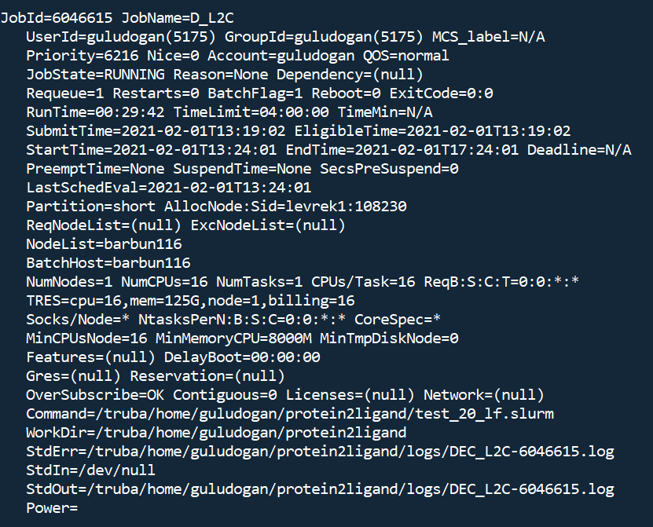

# Useful Linux Commands

## Tar

* Compressing files with particular extention 

    ```
    tar -czvf archive.tgz  `find . | egrep "0\.(json)$"`
    ```
    
* Extracting files   

    ```
    tar -xzvf archive.tgz
    ```
    
## Splitting and Concatenating Files

- Splitting a files into pieces (e.g. of 1000 lines)

  ```bash
  split -l 1000 <input-file> 
  ```

- Concatenating files

  ```bash
  cat xaa xaa xab > <output-file> 
  ```

## Awk

- To print all line with condition

  ```bash
  awk -F\, '<condition> {print}' <input-file>
  ```

- To print certain columns with output delimiter

  ```bash
  awk -F"," -v OFS=',' '{print $1, $7, $8, $18, $24, $40}' <input-file> > <output-file>
  ```

- ```bash 
  awk -F\, '{$5 = ( $5 == "N" ? 0 : 1)} 1' OFS=, <input-file> > <output-file>
  ```

 ## Encoding

* To learn encoding of a file,

  ```bash
  file <path-of-file>
  ```

* To convert encoding of file,

  ```bash
  iconv -f <current-encoding> -t <output-encoding> <input-file> > <output-file>
  ```

## Slurm Commands (particularly for TRUBA)

* Listing partitions 

  ```
  scontrol show partition
  ```
  
  
  
* Listing running jobs

   ```
   scontrol show job
   ```
   
   
   
* Listing estimated start times of jobs in the queue

   ```
   squeue --start
   ```   
   
* Viewing the status of nodes
  
  ```
  scontrol show node
  ```
  
  
  
* Viewing account information

  ```
  sacctmgr show associations where account=$accountname
  ```
  
  
  
* Viewing partition and node information (overview)

  ```
  sinfo -a
  ```
  
  
  
* Reporting usage of clusters by account.

  ```
  sreport cluster AccountUtilizationByUser user=$username start=2020-10-01
  ```
  
  
  
* Displaying information on jobs

  ```
  ssacct -j $jobid
  ```
  
  

## Vim Cheatsheet

* [Cheatsheet](vim_cheatsheet.md)

